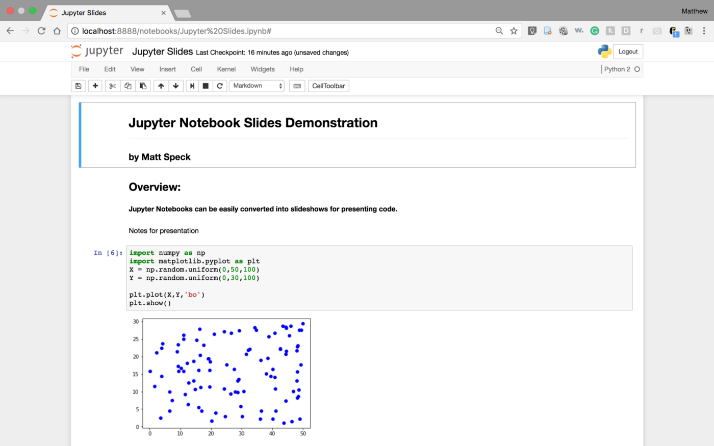

## Setting up a Development Environment

### Introduction

In this chapter, you will learn how to set up a Python development environment on your computer. A development environment is a software application that provides the necessary tools and resources for writing, testing, and debugging code. By the end of this chapter, you will have a working Python environment that you can use to start writing your own programs.

### Installing Python

There are several ways to install Python 3, here are some of the most common methods:

#### Using Anaconda

Anaconda is a popular distribution of Python and R for data science and machine learning. It comes with a lot of packages and libraries pre-installed, and it also includes the conda package manager, which makes it easy to install additional packages and manage environments. To install Python using Anaconda, you can follow these steps:

* Go to [the Anaconda Website](https://www.anaconda.com/) and download the latest version of Anaconda for your operating system.
* Once the download is complete, run the installer and follow the prompts to install Anaconda.
* Once installation is complete, open Anaconda Navigator, which is a graphical user interface that allows you to manage your environments and packages.
* Create a new environment with Python 3 by clicking the "Create" button and selecting "Python 3" as the version.

#### Using pip

pip is the package installer for Python. It allows you to install and manage packages for your Python installation. To install Python 3 and Jupyter Notebook using pip, you can follow these two steps:

* Make sure that Python 3 is installed on your system by running the command `python3 --version` in a terminal or command prompt.

* If Python 3 is not installed, download the latest version from [The Official Python Website](https://www.python.org/downloads/).

#### Using Homebrew (macOS and Linux)

Homebrew is a package manager for macOS and Linux. It allows you to install and manage packages for your operating system. To install Python 3 using Homebrew, you can follow these steps:

* Make sure that Homebrew is installed on your system by running the command `brew --version` in a terminal.
* If Homebrew is not installed, you can install it by following the instructions on [The Homebrew Website](https://brew.sh/).
* Once you have Homebrew installed, you can use it to install Python 3 by running the command `brew install python3` in a terminal.

#### Using Chocolatey (Windows)

Chocolatey is a package manager for Windows. It allows you to install and manage packages for your operating system. To install Python 3 using Chocolatey, you can follow these steps:

* Make sure that Chocolatey is installed on your system by running the command `choco --version` in a command prompt.
* If Chocolatey is not installed, you can install it by following the instructions on [The Chocolatey Website](https://chocolatey.org/).

* Once you have Chocolatey installed, you can use it to install Python 3 by running the command `choco install python` in a command prompt.

PS : It's also worth noting that many operating systems and Linux distributions come with Python 2 pre-installed, and you may want to install Python 3 alongside it without replacing the pre-installed Python 2. In this case, you should be careful when running pip and python commands, since you may need to use pip3 and python3, respectively, to ensure that you're using the correct version of the software.

### Choosing an IDE or Text Editor

Once you have Python installed, the next step is to choose a text editor or integrated development environment (IDE) to write your code in. An IDE is a software application that provides a comprehensive environment for coding, including features such as syntax highlighting, code completion, and debugging tools. In this class we're using Jupyter. Jupyter is an open-source web-based IDE that allows users to create and share documents that contain live code, equations, visualizations, and narrative text. It is particularly well-suited for data science because it:

* Provides an easy way to interact with data: Jupyter allows you to load, visualize, and manipulate data in a variety of formats, such as CSV, JSON, and SQL. This makes it a great tool for data exploration and analysis.

* Supports multiple programming languages: Jupyter supports many programming languages, including Python, R, and Julia, which makes it easy to use the language that is best suited for your project.

* Enables reproducible research: Jupyter allows you to organize your code, data, and visualizations in a single document, which makes it easy to reproduce your results and share your work with others.

* Provides a collaborative environment: Jupyter allows multiple users to work on the same notebook at the same time, which makes it a great tool for collaborative data science projects.

* Has a large and active community: Jupyter has a large and active community of developers, users, and contributors who provide support, resources, and add-ons that extend its functionality.

To install Jupyter:

* Using Anaconda: In your conda enviroment you can install Jupyter Notebook by running the command `conda install jupyter`. 

* Using pip3: You can install Jupyter using the pip package manager by running the command `pip3 install jupyter` in your command line. This method requires that you have Python3 and pip3 already installed on your system.

You can then launch Jupyter Notebook by running the command jupyter notebook in a terminal or command prompt.

 

 

Some popular IDEs for Python include PyCharm, Spyder, and IDLE. Text editors, such as Sublime Text, Atom, or Notepad++, are also popular among Python developers and are preferred by some. I suggest you [Install Sublime Text](https://www.sublimetext.com) as a second IDE.

### Installing Additional Libraries and Packages

Python has a vast collection of libraries and packages that can be used to perform a wide range of tasks. Some popular packages include NumPy and Pandas for data manipulation, Matplotlib and Seaborn for data visualization, and scikit-learn for machine learning. You can install these packages using the pip package manager, which is included with Python.

 

Examples : 

* `pip3 install numpy`
* `pip3 install pandas`

### Conclusion

By the end of this chapter, you should have a working Python development environment that you can use to start writing your own programs. You will have a Python interpreter, a text editor or IDE, and any additional libraries and packages that you need. In the next chapter, you will learn the basics of Python programming, including data types, variables, and operators.

